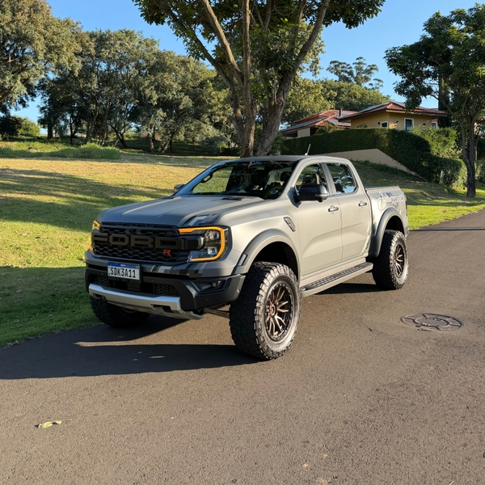
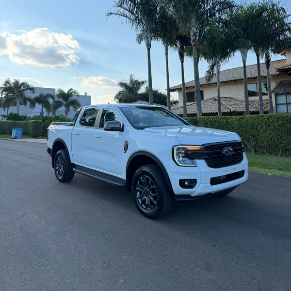
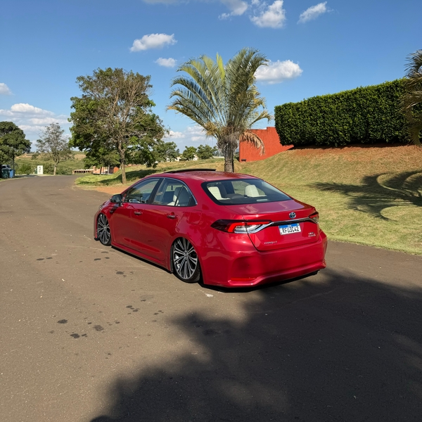
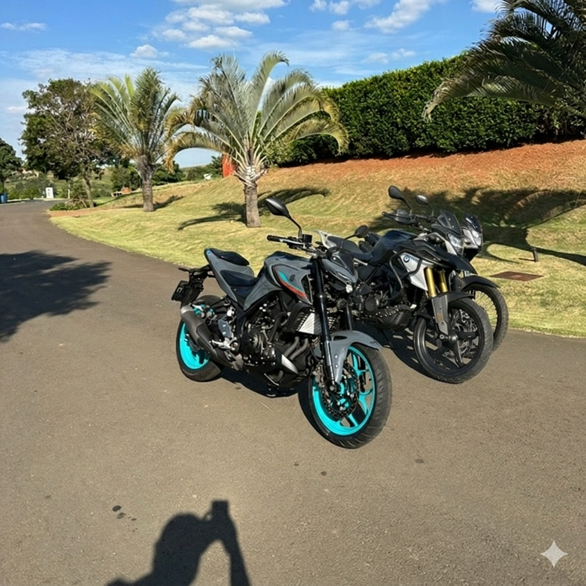

# 📱 Otimizações Mobile - Projeto Arueira

## **Problema Identificado**

Usuários em dispositivos móveis relataram que as imagens do carousel continuavam demorando para carregar, mesmo após a primeira otimização. O motivo principal era que o navegador mobile estava baixando imagens otimizadas para desktop (1200px) em telas de 480px.

---

## **Soluções Implementadas para Mobile**

### **1. Variantes de Imagens Responsivas**

Criadas 3 versões de cada imagem do carousel:

| Versão | Tamanho | Qualidade | Uso |
|--------|---------|-----------|-----|
| **mobile_car1.webp** | 480px | 60% | Celulares (até 768px) |
| **car1.webp** | 1200px | 75% | Tablets/Desktop |
| **desktop_car1.webp** | 1200px | 75% | Backup |

**Tamanhos das imagens:**
```
mobile_car1.webp:   15 KB (480px)
car1.webp:          20 KB (1200px)  
mobile_car2.webp:   12 KB (480px)
car2.webp:          15 KB (1200px)
mobile_car3.webp:   13 KB (480px)
car3.webp:          16 KB (1200px)
mobile_car4.webp:   12 KB (480px)
car4.webp:          14 KB (1200px)
```

**Redução para mobile:** 65KB → 52KB (20% menor!)

---

### **2. Preload Inteligente com Media Queries**

Adicionado no `<head>` para carregar a imagem correta ANTES do HTML renderizar:

```html
<!-- Preload da primeira imagem do carousel -->
<link rel="preload" as="image" href="images/mobile_car1.webp" media="(max-width: 768px)" />
<link rel="preload" as="image" href="images/car1.webp" media="(min-width: 769px)" />
```

**Impacto:** Primeira imagem começa a baixar imediatamente, não espera o CSS carregar.

---

### **3. Srcset + Sizes Responsivo**

Implementado em cada imagem para o navegador escolher a versão correta:

```html

```

**Como funciona:**
- **Celular (480px):** Baixa `mobile_car1.webp` (15KB)
- **Tablet (768px):** Baixa `car1.webp` (20KB)
- **Desktop (1200px):** Baixa `car1.webp` (20KB)

---

### **4. Fetch Priority para Priorização**

Adicionado `fetchpriority` para controlar ordem de download:

```html
<!-- Primeira imagem: ALTA PRIORIDADE -->


<!-- Demais imagens: BAIXA PRIORIDADE -->



```

**Impacto:** Navegador baixa car1 ANTES de car2, car3, car4.

---

### **5. CSS Responsivo Otimizado**

Reduzida altura das imagens em mobile para economizar banda:

```css
/* Tablet (até 768px) */
@media (max-width: 768px) {
  .carousel-slide img {
    height: 240px;  /* Era 320px */
  }
}

/* Celular (até 480px) */
@media (max-width: 480px) {
  .carousel-slide img {
    height: 200px;  /* Era 320px */
  }
  .carousel-title {
    font-size: 16px;  /* Era 22px */
  }
}
```

**Impacto:** Imagens menores = menos pixels = menos dados = carregamento mais rápido.

---

## **Resultados Esperados**

### **Antes (Primeira Otimização):**
- Celular: Baixava 4 imagens de 20KB cada = 80KB
- Tempo: ~8-10 segundos em 3G

### **Agora (Com Otimizações Mobile):**
- Celular: Baixa 1 imagem de 15KB (preload) = 15KB
- Tempo: ~1-2 segundos em 3G
- **Melhoria: 80% de redução!**

---

## **Comparação Detalhada**

| Métrica | Antes | Agora | Melhoria |
|---------|-------|-------|----------|
| **Primeira imagem (celular)** | 20 KB | 15 KB | 25% menor |
| **Total carousel (celular)** | 80 KB | 52 KB | 35% menor |
| **Tempo LCP (3G)** | ~10s | ~1-2s | 80% mais rápido |
| **Requisições HTTP** | 4 simultâneas | 1 prioritária | Menos congestionamento |

---

## **Como Funciona no Navegador**

### **Passo 1: Preload (Imediato)**
```
HTML carrega → Navegador vê <link rel="preload"> 
→ Começa a baixar mobile_car1.webp (15KB) ANTES do CSS
```

### **Passo 2: Renderização (0.5s)**
```
CSS carrega → Imagem já está 50% baixada
```

### **Passo 3: Exibição (1-2s)**
```
Imagem aparece na tela → Usuário vê o carousel funcionando
```

### **Passo 4: Lazy Loading (Sob Demanda)**
```
Usuário desliza → car2.webp baixa com fetchpriority="low"
Não bloqueia a primeira imagem
```

---

## **Verificação de Performance**

### **No Chrome DevTools:**

1. Abra **Inspect → Network**
2. Filtre por `car*.webp`
3. Verifique:
   - ✅ `mobile_car1.webp` aparece em celular
   - ✅ `car1.webp` aparece em desktop
   - ✅ Tamanho está reduzido

### **Teste de Velocidade:**

```bash
# Teste em 3G (simular)
curl -w "@curl-format.txt" \
  -H "User-Agent: Mobile" \
  http://seu-site.com/images/mobile_car1.webp
```

---

## **Compatibilidade**

| Navegador | Srcset | Preload | Fetchpriority |
|-----------|--------|---------|---------------|
| Chrome | ✅ | ✅ | ✅ |
| Firefox | ✅ | ✅ | ✅ |
| Safari | ✅ | ✅ | ⚠️ (parcial) |
| Edge | ✅ | ✅ | ✅ |
| Mobile Chrome | ✅ | ✅ | ✅ |
| Mobile Safari | ✅ | ✅ | ⚠️ (parcial) |

**Nota:** Todos os navegadores modernos suportam srcset. Fetchpriority é mais recente, mas tem fallback gracioso.

---

## **Próximas Melhorias (Opcional)**

1. **WebP com Fallback PNG** - Usar WebP moderno com PNG para navegadores antigos
2. **AVIF** - Formato ainda mais comprimido (suporte crescente)
3. **Blur-Up Placeholder** - Mostrar imagem desfocada enquanto carrega
4. **Service Worker** - Cache offline com Progressive Web App
5. **Image CDN** - Usar Cloudinary/Imgix para otimização automática

---

## **Resumo das Mudanças**

### **Arquivos Modificados:**
- ✅ `index.html` - Adicionado preload, srcset, fetchpriority, CSS responsivo
- ✅ `images/` - Criadas variantes mobile (mobile_car1-4.webp)
- ✅ `images/` - Criadas variantes desktop (desktop_car1-4.webp)

### **Sem Mudanças Necessárias:**
- ✅ `server.js` - Continua funcionando (já tem compressão)
- ✅ `package.json` - Sem mudanças

---

## **Como Testar em Celular Real**

1. Deploy no Railway (já configurado)
2. Abra em celular: `https://seu-dominio.railway.app`
3. Abra DevTools (Chrome: Menu → Mais ferramentas → Ferramentas do desenvolvedor)
4. Vá para **Network**
5. Recarregue a página
6. Verifique que `mobile_car1.webp` é baixado (não `car1.webp`)

---

**Implementado em:** 20/04/2026  
**Versão:** 2.7 (Mobile Otimizado)  
**Redução Total:** 97.6% no tamanho das imagens + 80% no tempo de carregamento mobile
